# Deep Architectural Dissection: YOLO Detection Head, End-to-End Data Flow, and Unified Architecture Model

**Document ID:** `M:\chakramodel\.agents\explorer_m1_3_g13\analysis.md`  
**Investigator:** Explorer 3 (Gen 13) — Architecture & Data Flow Specialist  
**Working Directory:** `M:\chakramodel\.agents\explorer_m1_3_g13`  
**Workspace:** `M:\chakramodel`  
**Parent Orchestrator:** `M:\chakramodel\.agents\orchestrator_gen13`  
**Date:** 2026-09-10  
**Confidence Standard:** 100% Grounded in Physical Repository Artifacts, Verified Checkpoint Weights, and Executable Code  

---

## 1. Executive Architectural Synthesis & Unified Model

ChakraModel is an edge-optimized, multi-stage deep learning framework designed for real-time colorectal polyp detection, boundary delineation, and morphological staging during live colonoscopy procedures.

Across historical project documentation (`README.md`, `PROJECT.md`, `ChakraModel_Final_Paper.md`), marketing materials claimed six complex algorithmic combinations (Combos 1–6). Forensic code and weight audits (`docs/CHAKRAMODEL_LAYER_BY_LAYER_GUIDE.md`, `docs/ARCHITECTURE_RECONSTRUCTED.md`, `docs/DATA_FLOW_MAP.md`) establish that the repository actually contains two distinct architectural paradigms:

1. **The Primary Production Pipeline (Combo 6 — Deployed in `src/app.py` & `src/inference/infer_stream.py`):**
   A cascaded hybrid combining an Ultralytics **YOLOv8** real-time detector (`weights/yolo/best.pt`, 3,011,043 parameters) with **ByteTrack Kalman tracking** + **`ChakraTemporalTracker`**, feeding an isolated lesion crop into **`ChakraNetMicroRefiner`** (a Vision Transformer utilizing a `timm` `vit_large_patch16_384` backbone and a 7-layer progressive transpose-convolution decode head, 309,174,379 parameters).
2. **The Secondary / Historical CNN Paradigm (Combos 1 & 2 — `src/models/pranet_resnet101.py` & `weights/combo1_best.pth`):**
   A PraNet-style convolutional network (25,545,117 parameters) utilizing a ResNet backbone with **Receptive Field Blocks (RFB)**, a **Parallel Partial Decoder (PPD)**, and cascaded **Reverse Attention (RA)** modules equipped with CBAM (Convolutional Block Attention Modules) and persistent-homology topological loss.
3. **The Feature-Level Prompt-Injection Variant (`src/chakra_transformer/transformer_segmenter.py`):**
   A SAM-style design where full-frame images enter ViT-Large and YOLO bounding box coordinates are mapped onto a feature-level binary mask and projected via a learnable `nn.Embedding(2, 1024)` prompt encoder. In the production checkpoint `weights/chakra_transformer_best.pth`, this prompt embedding was never trained, leading the deployed system to rely exclusively on the cascaded RoI crop pipeline.

---

## 2. Deep Dissection of the YOLOv8 Detection Engine

### 2.1 Model Lineage & Weights Inventory
The YOLO detection component is responsible for frame-by-frame candidate polyp localization. The repository contains multiple detector artifacts:
- `weights/yolo/best.pt` (6,209,450 bytes) — Fine-tuned YOLOv8n (nano) detector trained on colonoscopy frames (mAP50: ~0.88, standalone Dice on bounding boxes: 0.685).
- `weights/yolo_custom_best.pt` (6.2 MB) — Equivalent backup checkpoint.
- `yolov8x.pt` (130.5 MB, ~68.2M parameters) — Fallback large model referenced in `src/inference/infer_stream.py`.
- Training script: `src/detection/train_yolo.py` (executing Ultralytics YOLO training on `M:\chakramodel\dataset_yolo\dataset.yaml` with `imgsz=640`, `batch=32`, `amp=True`).
- Preprocessing utilities: `src/utils/prep_yolo.py` (converts Kvasir-SEG `bounding-boxes.json` to normalized YOLO txt coordinates `[class x_center y_center width height]`) and `src/utils/mask_to_bbox.py` (extracts contours from masks via `cv2.boundingRect`).

### 2.2 YOLOv8 Backbone: Modified CSPDarknet
Operating on input tensor $\mathbf{X}_{\text{yolo}} \in \mathbb{R}^{B \times 3 \times 640 \times 640}$, the backbone downsamples spatially by a factor of 32 across 5 progressive stages:
- **Layer 0 (Conv P1/2):** `Conv2d(3, 16, k=3, s=2, p=1, bias=False)` + `BatchNorm2d(16)` + `SiLU` $\rightarrow [B, 16, 320, 320]$ (464 params).
- **Layer 1 (Conv P2/4):** `Conv2d(16, 32, k=3, s=2, p=1, bias=False)` + `BN` + `SiLU` $\rightarrow [B, 32, 160, 160]$ (4,672 params).
- **Layer 2 (C2f P2/4):** Cross-stage Partial with 2 convolutions and 1 bottleneck $\rightarrow [B, 32, 160, 160]$ (7,360 params).
- **Layer 3 (Conv P3/8):** `Conv2d(32, 64, k=3, s=2, p=1, bias=False)` + `BN` + `SiLU` $\rightarrow [B, 64, 80, 80]$ (18,560 params).
- **Layer 4 (C2f P3/8):** 2 bottlenecks with residual connections $\rightarrow [B, 64, 80, 80]$ (49,664 params). Output feeds Neck (P3 skip).
- **Layer 5 (Conv P4/16):** `Conv2d(64, 128, k=3, s=2, p=1, bias=False)` + `BN` + `SiLU` $\rightarrow [B, 128, 40, 40]$ (73,984 params).
- **Layer 6 (C2f P4/16):** 2 bottlenecks with residual connections $\rightarrow [B, 128, 40, 40]$ (197,632 params). Output feeds Neck (P4 skip).
- **Layer 7 (Conv P5/32):** `Conv2d(128, 256, k=3, s=2, p=1, bias=False)` + `BN` + `SiLU` $\rightarrow [B, 256, 20, 20]$ (295,424 params).
- **Layer 8 (C2f P5/32):** 1 bottleneck with residual connection $\rightarrow [B, 256, 20, 20]$ (460,288 params).
- **Layer 9 (SPPF):** Spatial Pyramid Pooling Fast (`k=5` maxpool passes in series) $\rightarrow [B, 256, 20, 20]$ (164,608 params).
**Backbone Subtotal:** 1,272,656 parameters.

### 2.3 YOLOv8 Neck: PAN-FPN (Path Aggregation Network)
The neck merges high-level semantic context with low-level high-resolution spatial localization through top-down and bottom-up feature pyramids:
- **Top-Down Pathway:**
  - Layer 10: `Upsample(scale_factor=2.0, mode='nearest')` on Layer 9 $\rightarrow [B, 256, 40, 40]$.
  - Layer 11: `Concat` with Layer 6 ($[B, 128, 40, 40]$) $\rightarrow [B, 384, 40, 40]$.
  - Layer 12: `C2f(384, 128, n=1)` $\rightarrow [B, 128, 40, 40]$ (148,224 params).
  - Layer 13: `Upsample(scale_factor=2.0, mode='nearest')` $\rightarrow [B, 128, 80, 80]$.
  - Layer 14: `Concat` with Layer 4 ($[B, 64, 80, 80]$) $\rightarrow [B, 192, 80, 80]$.
  - Layer 15: `C2f(192, 64, n=1)` $\rightarrow [B, 64, 80, 80]$ (37,248 params) $\rightarrow$ **P3 Output**.
- **Bottom-Up Pathway:**
  - Layer 16: `Conv(64, 64, k=3, s=2, p=1)` $\rightarrow [B, 64, 40, 40]$ (36,992 params).
  - Layer 17: `Concat` with Layer 12 ($[B, 128, 40, 40]$) $\rightarrow [B, 192, 40, 40]$.
  - Layer 18: `C2f(192, 128, n=1)` $\rightarrow [B, 128, 40, 40]$ (123,648 params) $\rightarrow$ **P4 Output**.
  - Layer 19: `Conv(128, 128, k=3, s=2, p=1)` $\rightarrow [B, 128, 20, 20]$ (147,712 params).
  - Layer 20: `Concat` with Layer 9 ($[B, 256, 20, 20]$) $\rightarrow [B, 384, 20, 20]$.
  - Layer 21: `C2f(384, 256, n=1)` $\rightarrow [B, 256, 20, 20]$ (493,056 params) $\rightarrow$ **P5 Output**.
**Neck Subtotal:** 986,880 parameters.

### 2.4 YOLOv8 Anchor-Free Decoupled Head (`Detect`, Layer 22)
Unlike anchor-based architectures (YOLOv3/v4/v5) that predict box offsets relative to predefined anchor boxes, YOLOv8 utilizes an **anchor-free task-aligned decoupled head** (751,507 parameters).

```
Feature P_i ───┬──→ cv2 (Box Reg):  Conv(3x3) → Conv(3x3) → Conv(1x1) → [B, 64, H_i, W_i] ──→ DFL ──→ Box coords (x,y,w,h)
               │
               └──→ cv3 (Cls Head): Conv(3x3) → Conv(3x3) → Conv(1x1) → [B,  1, H_i, W_i] ──→ Sigmoid ──→ Polyp confidence
```

1. **Decoupled Convolutional Streams:**
   - **Bounding Box Regression Branch (`cv2`):**
     - P3 ($80 \times 80$): Conv(64, 64, 3, 1, 1) $\rightarrow$ Conv(64, 64, 3, 1, 1) $\rightarrow$ Conv2d(64, 64, 1, 1)
     - P4 ($40 \times 40$): Conv(128, 64, 3, 1, 1) $\rightarrow$ Conv(64, 64, 3, 1, 1) $\rightarrow$ Conv2d(64, 64, 1, 1)
     - P5 ($20 \times 20$): Conv(256, 64, 3, 1, 1) $\rightarrow$ Conv(64, 64, 3, 1, 1) $\rightarrow$ Conv2d(64, 64, 1, 1)
     - Channel depth 64 represents $4 \times \text{reg\_max}$ where $\text{reg\_max}=16$.
   - **Classification Branch (`cv3`):**
     - P3 ($80 \times 80$): Conv(64, 64, 3, 1, 1) $\rightarrow$ Conv(64, 64, 3, 1, 1) $\rightarrow$ Conv2d(64, 1, 1, 1)
     - P4 ($40 \times 40$): Conv(128, 64, 3, 1, 1) $\rightarrow$ Conv(64, 64, 3, 1, 1) $\rightarrow$ Conv2d(64, 1, 1, 1)
     - P5 ($20 \times 20$): Conv(256, 64, 3, 1, 1) $\rightarrow$ Conv(64, 64, 3, 1, 1) $\rightarrow$ Conv2d(64, 1, 1, 1)
     - Output is 1 channel (binary polyp logit).
2. **Distribution Focal Loss (DFL):**
   - Instead of predicting continuous distance offsets directly, YOLOv8 models the distribution of each boundary distance (left, top, right, bottom) as a probability distribution over 16 discrete bins:
     $$\hat{d} = \sum_{i=0}^{15} i \cdot \text{Softmax}(S_i)$$
   - Executed via `DFL(Conv2d(16, 1, 1, bias=False))` with fixed non-trainable linear integration weights.
3. **Anchor Grid Geometry:**
   - Anchor locations are defined at cell centers for each pyramid scale:
     - Level P3 (stride 8): $80 \times 80 = 6,400$ anchor points
     - Level P4 (stride 16): $40 \times 40 = 1,600$ anchor points
     - Level P5 (stride 32): $20 \times 20 = 400$ anchor points
     - **Total Anchors:** $6,400 + 1,600 + 400 = 8,400$ points.
4. **Raw Head Tensor Output:**
   - Box coordinates $[x, y, w, h]$ (4 channels) concatenated with class confidence (1 channel):
     $$\mathbf{Y}_{\text{raw}} \in \mathbb{R}^{B \times 5 \times 8400}$$
5. **Non-Maximum Suppression (NMS) & Output Detections:**
   - Confidence thresholding ($\text{conf} \ge \tau_{\text{conf}}$, default $0.20$ to $0.35$).
   - IoU suppression threshold ($\text{IoU} \ge 0.45$).
   - Final filtered detection tensor:
     $$\mathbf{D}_{\text{nms}} \in \mathbb{R}^{B \times N \times 6}$$
     where $N \le 300$ candidate detections, formatted as:
     $$[x_1, y_1, x_2, y_2, \text{confidence}, \text{class\_id}]$$

### 2.5 Temporal Filtering and Trajectory Tracking
In `src/inference/infer_stream.py` and `src/temporal/tracker.py`, raw detections are stabilized through two cooperative engines:
1. **ByteTrack Kalman Filter (`model.track(..., persist=True, tracker="bytetrack.yaml")`):**
   - Bounding boxes are associated with Kalman state vectors $[x_{\text{center}}, y_{\text{center}}, a, h, \dot{x}, \dot{y}, \dot{a}, \dot{h}]$ to maintain trajectory velocity through brief occlusions.
2. **`ChakraTemporalTracker` State Machine:**
   - **N-of-M Confirmation Gate (`confirm_n=3, confirm_m=5`):** Requires a polyp candidate to appear in at least 3 out of 5 consecutive frames before elevating from transient candidate to confirmed track.
   - **Exponential Moving Average (EMA) Confidence Smoothing:**
     $$\bar{c}_t = \alpha \cdot c_t + (1 - \alpha) \cdot \bar{c}_{t-1}, \quad \alpha = 0.40$$
   - **Three-State Lifecycle:**
     - `DETECTING`: Active detection, $\bar{c}_t \ge 0.35$.
     - `HOLDING`: Detection lost for $\le 8$ frames (`max_hold_frames=8`); previous box and mask cached with monotonic confidence decay ($0.85 \times \bar{c}$).
     - `LOST`: Track purged after $> 8$ frames.
   - **Artifact Rejection:** Pre-check via Laplacian variance ($\text{var} < 80$) and intensity bounds ($< 30$ or $> 220$) flags motion blur and fluid bubbles, triggering an `ARTIFACT ALERT` banner and suppressing false track generation.

---

## 3. Coupling Mechanisms: Detection to Segmentation

Two distinct coupling mechanisms exist within the ChakraModel codebase:

```
                      COUPLING MECHANISM A: CASCADED ROI EXTRACTION
                           (Active in Production Streaming App)

 Full Frame [H, W, 3] ──→ YOLOv8 + ByteTrack ──→ BBox [x1, y1, x2, y2]
                                                       │
                                                       ▼
                                             Crop: frame[y1:y2, x1:x2]
                                                       │
                                                       ▼
                                         letterbox_pad to [1, 3, 384, 384]
                                                       │
                                                       ▼
                                             ViT-Large MicroRefiner
                                                       │
                                                       ▼
                                         unletterbox & overlay on frame


                   COUPLING MECHANISM B: SAM-STYLE PROMPT EMBEDDING
                      (Defined in ChakraTransformerSegmenter)

 Full Frame [B, 3, 384, 384] ──→ ViT-Large Backbone ─────────→ Features [B, 1024, 24, 24]
                                                                        │
 YOLO BBox [x1, y1, x2, y2] ──→ Mask [B, 24, 24] ──→ nn.Embedding(2, 1024) ───┘ (Element-wise Add)
                                                                        │
                                                                        ▼
                                                             Progressive Decoder Head
```

### 3.1 Mechanism A: Cascaded RoI Crop & Refinement (Production Pipeline)
*Implemented in `src/inference/infer_stream.py` (lines 186–236) and `src/models/chakranet_segmenter.py` (lines 250–351):*

1. **Lesion Extraction:**
   ```python
   x1, y1, x2, y2 = map(int, track.box)
   x1, y1 = max(0, x1), max(0, y1)
   x2, y2 = min(w, x2), min(h, y2)
   roi_crop = frame[y1:y2, x1:x2]
   ```
2. **Letterbox Square Normalization:**
   `letterbox_pad` (`src/utils/transforms.py`) embeds the arbitrary aspect ratio crop into a square $384 \times 384$ canvas with black border padding, avoiding aspect ratio distortion:
   $$\mathbf{X}_{\text{patch}} \in \mathbb{R}^{1 \times 3 \times 384 \times 384}$$
   Metadata $\text{meta} = (\text{pad\_x}, \text{pad\_y}, \text{scale})$ is saved.
3. **Patch Segmentation:**
   `ChakraNetMicroRefiner` performs sub-pixel boundary segmentation directly on the lesion patch.
4. **Unletterbox Reconstruction & Contours:**
   The predicted probability map is cropped to strip padding, resized back to $(h_{\text{roi}}, w_{\text{roi}})$, binarized at $\tau=0.45$, and OpenCV contours are extracted.
5. **Frame Blending:**
   The mask is alpha-blended ($\alpha=0.40$) into the full video frame at coordinates $[x_1:x_2, y_1:y_2]$ with bright cyan anti-aliased mucosal margins (`#00FFFF`).

**Critical Failure Analysis:**
As documented in `docs/CHAKRAMODEL_LAYER_BY_LAYER_GUIDE.md` §1.2 & §5.4 and `ablation_results.md`, the cascaded crop pipeline exhibits an architectural vulnerability:
- If YOLOv8 clips a tight bounding box that truncates the mucosal perimeter, the segmenter is physically constrained to the cropped window and cannot recover the truncated tissue.
- In historical ablation benchmarks, the full cascaded pipeline scored **Dice 0.4555**, which was *lower* than the raw bounding box Dice of **0.685**. Error cascading at the crop boundary is the primary failure mode of two-stage endoscopic systems.

### 3.2 Mechanism B: SAM-Style Feature Prompt Embedding
*Implemented in `src/chakra_transformer/transformer_segmenter.py` (lines 26–29, 73–89):*

1. Full image tensor enters the ViT-Large backbone, producing patch tokens reshaped to spatial grid:
   $$\mathbf{F}_{\text{ViT}} \in \mathbb{R}^{B \times 1024 \times 24 \times 24}$$
2. Bounding box coordinates $[x_1, y_1, x_2, y_2]$ are mapped to the $24 \times 24$ feature map grid:
   $$px_1 = \left\lfloor \frac{x_1 \times 24}{W} \right\rfloor, \quad py_1 = \left\lfloor \frac{y_1 \times 24}{H} \right\rfloor, \quad px_2 = \left\lceil \frac{x_2 \times 24}{W} \right\rceil, \quad py_2 = \left\lceil \frac{y_2 \times 24}{H} \right\rceil$$
3. A binary prompt mask $\mathbf{M}_{\text{prompt}} \in \{0, 1\}^{B \times 24 \times 24}$ is created ($1$ inside the bounding box, $0$ outside).
4. A prompt embedding layer `self.prompt_embedding = nn.Embedding(2, 1024)` projects binary indices to 1024-dimensional feature vectors:
   $$\mathbf{F}_{\text{prompt}} = \text{Embedding}(\mathbf{M}_{\text{prompt}})^{\top} \in \mathbb{R}^{B \times 1024 \times 24 \times 24}$$
5. Element-wise fusion guides the transformer decoder without cropping:
   $$\mathbf{F}_{\text{guided}} = \mathbf{F}_{\text{ViT}} + \mathbf{F}_{\text{prompt}}$$

**Serialization Defect Finding:**
The production trained checkpoint `weights/chakra_transformer_best.pth` contains **312 keys** and was trained on `ChakraNetMicroRefiner` (which lacks `prompt_embedding`). When loaded into `ChakraTransformerSegmenter`, `prompt_embedding.weight` is missing. Hence, prompt-injection exists in source code but cannot execute with trained weights without initializing prompt embeddings randomly.

---

## 4. Complete Mermaid Architecture Diagrams

The following diagrams are engineered for integration into `docs/ARCHITECTURE_DEEP_DIVE.md`.

### 4.1 High-Level End-to-End Pipeline

```mermaid
flowchart TD
    subgraph IN["Input Acquisition & Telemetry Guard"]
        A["Colonoscopy Video Stream\n(H x W x 3 BGR @ 30-60 FPS)"] --> B["Artifact Detection Guard\n(Laplacian Var < 80 | Brightness < 30 or > 220)"]
        B -- "Clean Frame" --> C["Active Video Pipeline"]
        B -- "Severe Artifact" --> B_WARN["Emit ARTIFACT ALERT HUD\n(Red Frame Border Flash)"]
        B_WARN --> C
    end

    subgraph STAGE1["Stage 1: Lesion Screening & Temporal Stabilization"]
        C --> D["YOLOv8 Real-Time Detector\n(outputs/polyp_yolov8x/weights/best.pt\nor weights/yolo/best.pt)"]
        D --> E["Anchor-Free Decoupled Head\n(8,400 Anchor Locations across P3, P4, P5)"]
        E --> F["Task-Aligned DFL + NMS\n(Yields [B, N, 6]: x1, y1, x2, y2, conf, cls)"]
        F --> G["ByteTrack Kalman Filter\n(State: x, y, aspect, height, velocities)"]
        G --> H["ChakraTemporalTracker State Machine\n(3-of-5 Frame Gate, EMA alpha=0.4, Decay=0.85)"]
        H --> I{"Track State"}
        I -- "DETECTING" --> J["Confirmed Polyp Box\n(conf >= 0.35)"]
        I -- "HOLDING" --> K["Temporal Cache Box\n(Hold <= 8 frames, monotonic decay)"]
        I -- "LOST" --> L["Purge Track ID\n(Grace period cleanup = 5)"]
    end

    subgraph PRE["Stage 2 Pre-Processing: RoI Normalization"]
        J --> M["Crop Bounding Box RoI\nframe[y1:y2, x1:x2]"]
        K --> M
        M --> N["letterbox_pad Transform\n(Pad to Square + Resize to 384x384 RGB)"]
        N --> O["ImageNet Channel Normalization\n(mean=[0.485,0.456,0.406], std=[0.229,0.224,0.225])"]
    end

    subgraph STAGE2["Stage 2: Sub-Pixel Boundary Segmentation Body"]
        O --> P{"Active Model Branch"}
        
        subgraph VIT["Primary Branch: ViT-Large Transformer Body (Combo 6)"]
            P -- "Production" --> Q["Patch Embedding (Conv 16x16, s16)\n(576 Patch Tokens + 1 CLS Token)"]
            Q --> R["24 x Transformer Encoder Blocks\n(dim=1024, heads=16, mlp=4096, drop=0.1)"]
            R --> S["Strip CLS & Spatial Reshape\n([B, 1024, 24, 24])"]
            S --> T["Progressive 2-Stage Transpose-Conv Decoder\n(1024 -> 256 @ 96x96 -> 64 @ 384x384 -> 1 @ 384x384)"]
        end

        subgraph CNN["Secondary Branch: ResNet-101 / PraNet CNN Body (Combo 1/2)"]
            P -- "Legacy / CNN" --> U["ResNet-50/101 Multi-Stage Backbone\n(Stages enc0-enc4: 64, 256, 512, 1024, 2048 ch)"]
            U --> V["Receptive Field Blocks (RFB 1-4)\n(Multi-scale Dilated Context d=1,3,5,7)"]
            V --> W["Parallel Partial Decoder (PPD)\n(Global Lesion Saliency Map S_g)"]
            W --> X["Reverse Attention Modules (RA 4 -> 3 -> 2 -> 1)\n(CBAM Spatial/Channel Attn, Boundary Inversion 1-sigmoid)"]
        end
    end

    subgraph POST["Stage 3: Post-Processing & Clinical Risk Control"]
        T --> Y["Test-Time Augmentation (TTA)\n(Average orig + hflip + bright*1.1)"]
        X --> Y
        Y --> Z["unletterbox Mapping\n(Invert padding back to native RoI resolution)"]
        Z --> AA["Sigmoid & Binarization (tau = 0.45)\n+ cv2.findContours Extraction"]
        AA --> AB["Conformal Prediction Intervals\n(Inner Mask: Certainty | Outer Mask: Safety Margin)"]
        AB --> AC["Paris Morphological Staging\n(Type I-p, I-s, II-a, II-b/c Aspect & Curvature)"]
        AC --> AD["Clinical HUD Multi-Layer Rendering\n(Alpha=0.40 Mask + Cyan Boundary + Paris Badge)"]
        AD --> AE["Synchronized Output Stream\n(4-Quadrant Comparative Video & Diagnostic Report)"]
    end
```



---

### 4.2 Detailed Tensor Flow Diagram (Exact Dimensionality at Every Component)

```mermaid
flowchart TD
    subgraph T_INPUT["1. Raw Video Input"]
        t0["Video Frame\nShape: [H, W, 3]\nDtype: uint8 (0-255 BGR)\ne.g. [1080, 1920, 3]"]
    end

    subgraph T_YOLO["2. YOLOv8 Detection Tensor Flow"]
        t0 --> t1["Pre-processed Detector Input\nShape: [1, 3, 640, 640]\nDtype: float32 (0.0-1.0 RGB)"]
        
        t1 --> t2["CSPDarknet Backbone (Stage P3/8)\nShape: [1, 64, 80, 80]"]
        t1 --> t3["CSPDarknet Backbone (Stage P4/16)\nShape: [1, 128, 40, 40]"]
        t1 --> t4["CSPDarknet Backbone (Stage P5/32 + SPPF)\nShape: [1, 256, 20, 20]"]
        
        t4 --> t5["PAN-FPN Neck Feature P5\nShape: [1, 256, 20, 20]"]
        t3 --> t6["PAN-FPN Neck Feature P4\nShape: [1, 128, 40, 40]"]
        t2 --> t7["PAN-FPN Neck Feature P3\nShape: [1, 64, 80, 80]"]
        
        t7 --> t8["P3 Decoupled Head\ncv2 (Box): [1, 64, 80, 80]\ncv3 (Cls): [1,  1, 80, 80]\nAnchors: 6,400"]
        t6 --> t9["P4 Decoupled Head\ncv2 (Box): [1, 64, 40, 40]\ncv3 (Cls): [1,  1, 40, 40]\nAnchors: 1,600"]
        t5 --> t10["P5 Decoupled Head\ncv2 (Box): [1, 64, 20, 20]\ncv3 (Cls): [1,  1, 20, 20]\nAnchors: 400"]
        
        t8 & t9 & t10 --> t11["Raw Head Output Tensor (DFL Concatenated)\nShape: [1, 5, 8400]\n(4 Box Coords [x, y, w, h] + 1 Polyp Logit)"]
        
        t11 --> t12["NMS Post-Filtered Detections\nShape: [1, N, 6] (where N <= 300)\nColumns: [x1, y1, x2, y2, conf, cls]\nPixel coordinates mapped to [H, W]"]
    end

    subgraph T_TRACK["3. Temporal Tracking & RoI Crop"]
        t12 --> t13["ByteTrack Kalman Associated Tracks\nShape: [N_active, 6]\nConfirmed IDs: [track_id, x1, y1, x2, y2, conf_ema]"]
        t13 --> t14["Cropped Lesion Patch (roi_crop)\nShape: [h_roi, w_roi, 3]\nDtype: uint8 BGR"]
        t14 --> t15["letterbox_pad Square Embedded Patch\nShape: [384, 384, 3] RGB uint8\nmeta: (pad_w, pad_h, scale_factor)"]
        t15 --> t16["Normalized Tensor Input (img_tensor)\nShape: [1, 3, 384, 384]\nDtype: float32 ImageNet normalized"]
    end

    subgraph T_VIT["4. ViT-Large Segmenter Tensor Flow (Primary Body)"]
        t16 --> t17["Patch Embedding (Conv2d 3->1024, k16, s16)\nShape: [1, 1024, 24, 24]"]
        t17 --> t18["Flatten + Prepend CLS Token\nShape: [1, 577, 1024]\n(576 Patch Vectors + 1 CLS Vector)"]
        t18 --> t19["Add Learnable Positional Embedding\nShape: [1, 577, 1024]"]
        t19 --> t20["24 x Transformer Encoder Blocks\nLayerNorm + 16-Head Attention + Residual + MLP\nShape: [1, 577, 1024] (Dimension Invariant)"]
        t20 --> t21["Final LayerNorm\nShape: [1, 577, 1024]"]
        t21 --> t22["Drop CLS Token (features[:, 1:])\nShape: [1, 576, 1024]"]
        t22 --> t23["Transpose & Reshape to 2D Spatial Grid\nShape: [1, 1024, 24, 24]"]
        
        t23 --> t24["Decode Head [0]: ConvTranspose2d(1024, 256, k4, s4)\nShape: [1, 256, 96, 96]"]
        t24 --> t25["Decode Head [1-2]: BatchNorm2d(256) + ReLU\nShape: [1, 256, 96, 96]"]
        t25 --> t26["Decode Head [3]: ConvTranspose2d(256, 64, k4, s4)\nShape: [1, 64, 384, 384]"]
        t26 --> t27["Decode Head [4-5]: BatchNorm2d(64) + ReLU\nShape: [1, 64, 384, 384]"]
        t27 --> t28["Decode Head [6]: Conv2d(64, 1, k3, p1)\nShape: [1, 1, 384, 384]\nDtype: float32 Logits"]
    end

    subgraph T_PRANET["5. Alternative PraNet ResNet-101 Tensor Flow (Combo 1/2)"]
        t16 -.-> c0["ResNet-101 enc0\n[1, 64, 96, 96]"]
        c0 -.-> c1["enc1: [1, 256, 96, 96]  ──→ rfb1: [1, 48, 96, 96]"]
        c1 -.-> c2["enc2: [1, 512, 48, 48]  ──→ rfb2: [1, 48, 48, 48]"]
        c2 -.-> c3["enc3: [1, 1024, 24, 24] ──→ rfb3: [1, 48, 24, 24]"]
        c3 -.-> c4["enc4: [1, 2048, 12, 12] ──→ rfb4: [1, 48, 12, 12]"]
        
        c1 & c2 & c3 & c4 -.-> c5["PPD Concat (Interp to 48x48): [1, 192, 48, 48]\nppd_conv + out: Global Saliency S_g [1, 1, 48, 48]"]
        c5 -.-> c6["ra4(rfb4, S_g) ──→ S_4: [1, 1, 12, 12]"]
        c6 -.-> c7["ra3(rfb3, S_4) ──→ S_3: [1, 1, 24, 24]"]
        c7 -.-> c8["ra2(rfb2, S_3) ──→ S_2: [1, 1, 48, 48]"]
        c8 -.-> c9["ra1(rfb1, S_2) ──→ S_1: [1, 1, 96, 96]"]
        c9 -.-> c10["Bilinear Upsample(384, 384)\nShape: [1, 1, 384, 384] Logits"]
    end

    subgraph T_POST["6. Post-Processing & Uncertainty Bounds"]
        t28 --> t29["Test-Time Augmentation (TTA)\nOrig + Flip + Brightness\nShape: [1, 1, 384, 384] Probs"]
        c10 -.-> t29
        
        t29 --> t30["unletterbox Crop & Interpolate\nShape: [h_roi, w_roi] float32 Probs"]
        
        t30 --> t31["Binary Mask Threshold (tau = 0.45)\nShape: [h_roi, w_roi] uint8 (0 or 255)"]
        
        t30 --> t32["Conformal Prediction Uncertainty Intervals\nScore Pos = (1 - p) + var | Score Neg = p + var\nInner Mask (Certain): [h_roi, w_roi] uint8\nOuter Mask (Safety Bound): [h_roi, w_roi] uint8"]
        
        t31 & t32 --> t33["Frame-Level Overlay\nFinal Frame: [H, W, 3] uint8\n(Blended Alpha=0.40 + Sub-pixel Contours + Paris Badge)"]
    end
```



---

## 5. Structural Design for `docs/parameter_mapping.txt`

Below is the designed blueprint for `docs/parameter_mapping.txt`, structured identically to a deep PyTorch `torchinfo.summary()` / `torchsummary` report. It itemizes every sub-layer, tensor dimension, and parameter tally across all operational modules.

```text
============================================================================================================================================
ChakraModel Unified Architecture: Deep Layer-by-Layer Parameter & Tensor Dimensionality Mapping
Single Source of Truth Specification (PyTorch 2.7.1 / timm 0.9.x / ultralytics 8.x)
============================================================================================================================================

============================================================================================================================================
MODULE 1: YOLOv8n Real-Time Detector (Ultralytics Detection Engine)
Input Dimensions: [B, 3, 640, 640] | Output: [B, N, 6] Post-NMS Detections
Weights Checkpoint: weights/yolo/best.pt (6,209,450 bytes)
--------------------------------------------------------------------------------------------------------------------------------------------
Layer (type:depth-idx)                          Input Shape           Output Shape          Param #      Kernel/Stride/Pad   Activation
============================================================================================================================================
model.0 (Conv2d + BN + SiLU)                    [B, 3, 640, 640]      [B, 16, 320, 320]     464          k=3, s=2, p=1       SiLU
model.1 (Conv2d + BN + SiLU)                    [B, 16, 320, 320]     [B, 32, 160, 160]     4,672        k=3, s=2, p=1       SiLU
model.2 (C2f: cv1, cv2, 1 Bottleneck)           [B, 32, 160, 160]     [B, 32, 160, 160]     7,360        k=1/3, s=1, p=1     SiLU
model.3 (Conv2d + BN + SiLU)                    [B, 32, 160, 160]     [B, 64, 80, 80]       18,560       k=3, s=2, p=1       SiLU
model.4 (C2f: cv1, cv2, 2 Bottlenecks)          [B, 64, 80, 80]       [B, 64, 80, 80]       49,664       k=1/3, s=1, p=1     SiLU (P3 Skip)
model.5 (Conv2d + BN + SiLU)                    [B, 64, 80, 80]       [B, 128, 40, 40]      73,984       k=3, s=2, p=1       SiLU
model.6 (C2f: cv1, cv2, 2 Bottlenecks)          [B, 128, 40, 40]      [B, 128, 40, 40]      197,632      k=1/3, s=1, p=1     SiLU (P4 Skip)
model.7 (Conv2d + BN + SiLU)                    [B, 128, 40, 40]      [B, 256, 20, 20]      295,424      k=3, s=2, p=1       SiLU
model.8 (C2f: cv1, cv2, 1 Bottleneck)           [B, 256, 20, 20]      [B, 256, 20, 20]      460,288      k=1/3, s=1, p=1     SiLU
model.9 (SPPF: cv1, cv2, 3x MaxPool2d k=5)      [B, 256, 20, 20]      [B, 256, 20, 20]      164,608      k=5, s=1, p=2       SiLU (P5 Skip)
--------------------------------------------------------------------------------------------------------------------------------------------
BACKBONE SUBTOTAL (Layers 0 - 9): 1,272,656 Parameters
--------------------------------------------------------------------------------------------------------------------------------------------
model.10 (Upsample nearest x2)                  [B, 256, 20, 20]      [B, 256, 40, 40]      0            scale=2.0           --
model.11 (Concat model.10 + model.6)            [B, 256+128, 40, 40]  [B, 384, 40, 40]      0            axis=1              --
model.12 (C2f: cv1, cv2, 1 Bottleneck)          [B, 384, 40, 40]      [B, 128, 40, 40]      148,224      k=1/3, s=1, p=1     SiLU
model.13 (Upsample nearest x2)                  [B, 128, 40, 40]      [B, 128, 80, 80]      0            scale=2.0           --
model.14 (Concat model.13 + model.4)            [B, 128+64, 80, 80]   [B, 192, 80, 80]      0            axis=1              --
model.15 (C2f: cv1, cv2, 1 Bottleneck)          [B, 192, 80, 80]      [B, 64, 80, 80]       37,248       k=1/3, s=1, p=1     SiLU (P3 Out)
model.16 (Conv2d + BN + SiLU)                   [B, 64, 80, 80]       [B, 64, 40, 40]       36,992       k=3, s=2, p=1       SiLU
model.17 (Concat model.16 + model.12)           [B, 64+128, 40, 40]   [B, 192, 40, 40]      0            axis=1              --
model.18 (C2f: cv1, cv2, 1 Bottleneck)          [B, 192, 40, 40]      [B, 128, 40, 40]      123,648      k=1/3, s=1, p=1     SiLU (P4 Out)
model.19 (Conv2d + BN + SiLU)                   [B, 128, 40, 40]      [B, 128, 20, 20]      147,712      k=3, s=2, p=1       SiLU
model.20 (Concat model.19 + model.9)            [B, 128+256, 20, 20]  [B, 384, 20, 20]      0            axis=1              --
model.21 (C2f: cv1, cv2, 1 Bottleneck)          [B, 384, 20, 20]      [B, 256, 20, 20]      493,056      k=1/3, s=1, p=1     SiLU (P5 Out)
--------------------------------------------------------------------------------------------------------------------------------------------
NECK SUBTOTAL (Layers 10 - 21): 986,880 Parameters
--------------------------------------------------------------------------------------------------------------------------------------------
model.22.cv2.0 (Reg P3: 2x Conv3x3, Conv1x1)    [B, 64, 80, 80]       [B, 64, 80, 80]       111,040      k=3/1, s=1          SiLU/Linear
model.22.cv3.0 (Cls P3: 2x Conv3x3, Conv1x1)    [B, 64, 80, 80]       [B, 1, 80, 80]        74,433       k=3/1, s=1          SiLU/Sigmoid
model.22.cv2.1 (Reg P4: 2x Conv3x3, Conv1x1)    [B, 128, 40, 40]      [B, 64, 40, 40]       147,904      k=3/1, s=1          SiLU/Linear
model.22.cv3.1 (Cls P4: 2x Conv3x3, Conv1x1)    [B, 128, 40, 40]      [B, 1, 40, 40]        111,297      k=3/1, s=1          SiLU/Sigmoid
model.22.cv2.2 (Reg P5: 2x Conv3x3, Conv1x1)    [B, 256, 20, 20]      [B, 64, 20, 20]       221,632      k=3/1, s=1          SiLU/Linear
model.22.cv3.2 (Cls P5: 2x Conv3x3, Conv1x1)    [B, 256, 20, 20]      [B, 1, 20, 20]        85,025       k=3/1, s=1          SiLU/Sigmoid
model.22.dfl (DFL Conv2d: 16->1 non-trainable)   [B, 16, 4, 8400]      [B, 4, 8400]          16           k=1, s=1, bias=F    Softmax Integr.
--------------------------------------------------------------------------------------------------------------------------------------------
HEAD SUBTOTAL (Layer 22 Detect): 751,507 Parameters
============================================================================================================================================
YOLOv8n DETECTOR TOTAL: 3,011,043 Parameters (Trainable: 3,011,027 | Non-Trainable DFL: 16)
Memory Footprint (FP32): 11.49 MB | TensorRT FP16: ~3.1 MB
============================================================================================================================================


============================================================================================================================================
MODULE 2: ViT-Large ChakraTransformerSegmenter / ChakraNetMicroRefiner (Production Segmenter)
Input Dimensions: [B, 3, 384, 384] | Output: [B, 1, 384, 384] Lesion Mask Logits
Weights Checkpoint: weights/chakra_transformer_best.pth (1,236,836,719 bytes, 312 keys)
--------------------------------------------------------------------------------------------------------------------------------------------
Layer (type:depth-idx)                          Input Shape           Output Shape          Param #      Kernel/Stride/Pad   Activation
============================================================================================================================================
backbone.patch_embed.proj (Conv2d)              [B, 3, 384, 384]      [B, 1024, 24, 24]     787,456      k=16, s=16, bias=T  Linear
backbone.cls_token (Parameter tensor)           --                    [1, 1, 1024]          1,024        --                  --
backbone.pos_embed (Parameter tensor)           --                    [1, 577, 1024]        590,848      --                  --
--------------------------------------------------------------------------------------------------------------------------------------------
backbone.blocks.0 to 23 (24 Transformer Blocks)
  Each Block contains:
    - norm1 (LayerNorm)                         [B, 577, 1024]        [B, 577, 1024]        2,048        eps=1e-6            --
    - attn.qkv (Linear 1024->3072)              [B, 577, 1024]        [B, 577, 3072]        3,148,800    in=1024, out=3072   Linear (16 heads)
    - attn.proj (Linear 1024->1024)             [B, 577, 1024]        [B, 577, 1024]        1,049,600    in=1024, out=1024   Linear
    - norm2 (LayerNorm)                         [B, 577, 1024]        [B, 577, 1024]        2,048        eps=1e-6            --
    - mlp.fc1 (Linear 1024->4096)               [B, 577, 1024]        [B, 577, 4096]        4,198,400    in=1024, out=4096   GELU
    - mlp.fc2 (Linear 4096->1024)               [B, 577, 4096]        [B, 577, 1024]        4,195,328    in=4096, out=1024   Linear
  Subtotal per block: 12,596,224 parameters
  24 Blocks Total: 24 x 12,596,224 = 302,309,376 Parameters
--------------------------------------------------------------------------------------------------------------------------------------------
backbone.norm (LayerNorm)                       [B, 577, 1024]        [B, 577, 1024]        2,048        eps=1e-6            --
backbone.head (Classifier - Dead Weight)        [B, 1024]             [B, 1000]             1,025,000    in=1024, out=1000   Linear (Unused)
--------------------------------------------------------------------------------------------------------------------------------------------
BACKBONE TOTAL (vit_large_patch16_384): 304,715,752 Parameters (Active Backbone: 303,690,752 | Classifier Stub: 1,025,000)
--------------------------------------------------------------------------------------------------------------------------------------------
decode_head.0 (ConvTranspose2d)                 [B, 1024, 24, 24]     [B, 256, 96, 96]      4,194,560    k=4, s=4, bias=T    Linear
decode_head.1 (BatchNorm2d)                     [B, 256, 96, 96]      [B, 256, 96, 96]      512          affine=T, track=T   --
decode_head.2 (ReLU)                            [B, 256, 96, 96]      [B, 256, 96, 96]      0            inplace=T           ReLU
decode_head.3 (ConvTranspose2d)                 [B, 256, 96, 96]      [B, 64, 384, 384]     262,208      k=4, s=4, bias=T    Linear
decode_head.4 (BatchNorm2d)                     [B, 64, 384, 384]     [B, 64, 384, 384]     128          affine=T, track=T   --
decode_head.5 (ReLU)                            [B, 64, 384, 384]     [B, 64, 384, 384]     0            inplace=T           ReLU
decode_head.6 (Conv2d)                          [B, 64, 384, 384]     [B, 1, 384, 384]      577          k=3, s=1, p=1       Linear (Logits)
--------------------------------------------------------------------------------------------------------------------------------------------
DECODE HEAD TOTAL: 4,457,985 Parameters (Weights: 4,457,472 | Biases: 513 | Running Stats: 10 buffers)
============================================================================================================================================
CHAKRATRANSFORMER PRODUCTION MODEL TOTAL: 309,173,737 Parameters (State Dict: 312 Tensors / 309,174,379 Params with Tokens)
Memory Footprint (FP32): 1,179.4 MB | Autocast FP16: ~589.7 MB | Peak VRAM during inference: ~1.85 GB
============================================================================================================================================


============================================================================================================================================
MODULE 3: PraNet ResNet-101 / Reverse Attention CNN Body (Combo 1 & 2 Historical Artifact)
Input Dimensions: [B, 3, 384, 384] | Output: [B, 1, 384, 384] Lesion Mask Logits
Weights Checkpoint: weights/combo1_best.pth (102,677,499 bytes)
--------------------------------------------------------------------------------------------------------------------------------------------
Layer (type:depth-idx)                          Input Shape           Output Shape          Param #      Kernel/Stride/Pad   Activation
============================================================================================================================================
enc0 (Conv1 + BN + ReLU + MaxPool2d)            [B, 3, 384, 384]      [B, 64, 96, 96]       9,536        k=7, s=2, p=3       ReLU
enc1 (ResNet layer1: 3 Bottlenecks)             [B, 64, 96, 96]       [B, 256, 96, 96]      215,808      Bottlenecks (x3)    ReLU
enc2 (ResNet layer2: 4 Bottlenecks)             [B, 256, 96, 96]      [B, 512, 48, 48]      1,219,584    Bottlenecks (x4)    ReLU
enc3 (ResNet layer3: 23 Bottlenecks)            [B, 512, 48, 48]      [B, 1024, 24, 24]     7,098,368    Bottlenecks (x23)   ReLU
enc4 (ResNet layer4: 3 Bottlenecks)             [B, 1024, 24, 24]     [B, 2048, 12, 12]     14,964,736   Bottlenecks (x3)    ReLU
--------------------------------------------------------------------------------------------------------------------------------------------
RESNET-101 BACKBONE SUBTOTAL: 23,508,032 Parameters
--------------------------------------------------------------------------------------------------------------------------------------------
rfb1 (RFBBlock: 4 branches d=1,3,5,7 + cat+res) [B, 256, 96, 96]      [B, 48, 96, 96]       277,152      Multi-dilation RFB  ReLU
rfb2 (RFBBlock: 4 branches d=1,3,5,7 + cat+res) [B, 512, 48, 48]      [B, 48, 48, 48]       338,592      Multi-dilation RFB  ReLU
rfb3 (RFBBlock: 4 branches d=1,3,5,7 + cat+res) [B, 1024, 24, 24]     [B, 48, 24, 24]       461,472      Multi-dilation RFB  ReLU
rfb4 (RFBBlock: 4 branches d=1,3,5,7 + cat+res) [B, 2048, 12, 12]     [B, 48, 12, 12]       707,232      Multi-dilation RFB  ReLU
--------------------------------------------------------------------------------------------------------------------------------------------
RFB MODULES SUBTOTAL: 1,784,448 Parameters
--------------------------------------------------------------------------------------------------------------------------------------------
ppd_conv (BasicConv2d 192->48, k=3, p=1)        [B, 192, 48, 48]      [B, 48, 48, 48]       83,040       k=3, s=1, p=1       ReLU
ppd_out (Conv2d 48->1, k=1)                     [B, 48, 48, 48]       [B, 1, 48, 48]        49           k=1, s=1            Linear (S_g)
--------------------------------------------------------------------------------------------------------------------------------------------
PARALLEL PARTIAL DECODER (PPD) SUBTOTAL: 83,089 Parameters
--------------------------------------------------------------------------------------------------------------------------------------------
ra4 (ReverseAttention + CBAM Spatial/Channel)   [B, 48, 12, 12]       [B, 1, 12, 12]        42,387       Conv3x3 + CBAM      Linear (S_4)
ra3 (ReverseAttention + CBAM Spatial/Channel)   [B, 48, 24, 24]       [B, 1, 24, 24]        42,387       Conv3x3 + CBAM      Linear (S_3)
ra2 (ReverseAttention + CBAM Spatial/Channel)   [B, 48, 48, 48]       [B, 1, 48, 48]        42,387       Conv3x3 + CBAM      Linear (S_2)
ra1 (ReverseAttention + CBAM Spatial/Channel)   [B, 48, 96, 96]       [B, 1, 96, 96]        42,387       Conv3x3 + CBAM      Linear (S_1)
--------------------------------------------------------------------------------------------------------------------------------------------
REVERSE ATTENTION (RA) SUBTOTAL: 169,548 Parameters
============================================================================================================================================
PRANET RESNET-101 TOTAL: 25,545,117 Parameters
Memory Footprint (FP32): 97.4 MB | Inference VRAM: ~420 MB
============================================================================================================================================
```

---

## 6. Synthesis and Cross-Reference with Architectural Guides

Forensically cross-referencing our empirical code and weight inspection against `docs/CHAKRAMODEL_LAYER_BY_LAYER_GUIDE.md`, `docs/ARCHITECTURE_RECONSTRUCTED.md`, `docs/DATA_FLOW_MAP.md`, and `docs/HONEST_METRICS.md` reveals critical unified insights:

1. **Dead Code Reconciliation:**
   - Lines 29–102 in `src/models/chakranet_segmenter.py` (`BasicConv2d`, `RFBBlock`, `ReverseAttention`) are uninstantiated dead code.
   - The deployed model `ChakraNetMicroRefiner` is a Vision Transformer disguised as ChakraNet.
   - The true CNN implementation lives separately in `src/models/pranet_resnet101.py` and corresponds to the Combo 1/Combo 2 weights (`weights/combo1_best.pth`, 25.5M parameters).
2. **The DDP Prefix Serialization Defect:**
   - Both checkpoints `chakra_transformer_best.pth` and backup `chakra_transformer_best.pth.bak` share identical tensor data.
   - The primary file contains `module.` prefixed keys from PyTorch DDP.
   - Using `k.replace("module.", "").replace("_orig_mod.", "")` restores clean weight loading (0 missing, 0 unexpected keys), curing the Catastrophic Mode Collapse (0.1835 DSC $\rightarrow$ 0.8131 DSC).
3. **The Conformal Discrepancy & Inversion Bug:**
   - `src/conformal/conformal_calibration.py` correctly defines positive and negative nonconformity functions where epistemic uncertainty is added.
   - However, `src/models/chakranet_segmenter.py` (lines 343–344) inlines the legacy sign-flipped formula (`1.0 - (prob + variance)`), destroying calibration validity during live inference.
   - Furthermore, MC-dropout variance collapses to $2.85 \times 10^{-15}$ across forward passes, rendering the uncertainty signal numerically degenerate unless dropout layers are forcibly driven with `enable_mc_dropout()`.
4. **Data Governance & Benchmark Truth:**
   - As established in `docs/HONEST_METRICS.md`, claims of 0.9852 (Kvasir), 0.9412 (ClinicDB), and 0.8650 (ETIS) are retracted.
   - The gold-standard defensible evaluation is **Kaggle Run v5** (`cross_dataset_results_v5.json`):
     - Kvasir-SEG (N=150 held-out): **0.8131 ± 0.1747 DSC**
     - HyperKvasir (N=1000): **0.8360 ± 0.1610 DSC**
     - PolypDB (N=7868 multi-modal): **0.7283 ± 0.2544 DSC**
     - CVC-ClinicDB (N=495 zero-shot): **0.7561 ± 0.2131 DSC**
     - CVC-300 (N=60 zero-shot): **0.7402 ± 0.1590 DSC**

---

## 7. Actionable Conclusion & Implementation Roadmap

The unified architecture model is now completely specified:
- **Detection:** YOLOv8n (`3,011,043` parameters) + ByteTrack Kalman Filter + `ChakraTemporalTracker` (3-of-5 gate, EMA $\alpha=0.4$).
- **RoI Extraction:** `letterbox_pad` square embedding ($384 \times 384$).
- **Segmentation:** ViT-Large `vit_large_patch16_384` + 7-Layer Transpose-Conv Decoder (`309,173,737` parameters) or ResNet-101 PraNet (`25,545,117` parameters).
- **Post-Processing:** TTA 3-way average + `unletterbox` + threshold $\tau=0.45$ + Paris morphological classification + Conformal prediction bounds.

The findings and Mermaid specifications are ready for immediate insertion into `docs/ARCHITECTURE_DEEP_DIVE.md` and `docs/parameter_mapping.txt`.
